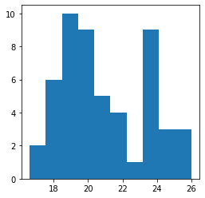
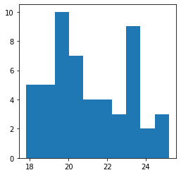
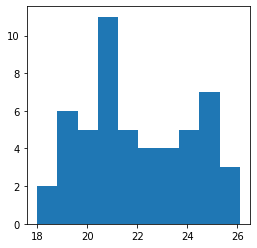
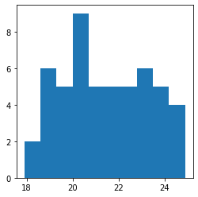
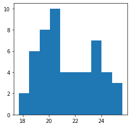
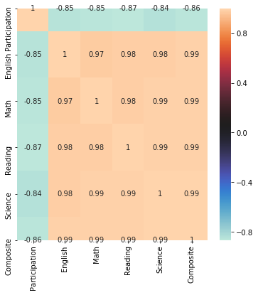

Title: Exploratory Analysis
Date: 2019-12-07
Slug: First blog

## Exploratory Analysis

So you come into work on a Monday morning and find that your boss has tasked you with finding some insights on a current data set. You open the excel file and see that there are countless rows and columns filled with data. What do you do next?

Well, because you are a trendy analyst or someone just looking to learn new skills, you decide to use Python.

In this short blog, I will teach you how to begin looking for insights into your data, or in other terms, exploratory analysis. We will use Python 3 and the libraries within Python to start our journey.

First off, you are going to import the Pandas library, Matplotlib library, and the Seaborn library.

```python
import pandas as pd
import matplotlib.pyplot as plt
import seaborn as sns
```

These are just a few of the libraries that are available for use within the Python language and in our case, will be the main libraries used for exploratory analysis.

Next, you will call your bosses saved excel file name that you would have saved as a CSV file.

```python
example_1 = pd.read_csv('~/Documents/projects/project_1/data/act_2018.csv')
```

Now that you have loaded your file into the notebook, or text editor, you can begin the initial analysis with some Pandas functions.

Run the .head() function to show the first five rows, and all the column names to see what each is called - this will help when you start plotting later.

```python
example_1.head()
```


<div>
<style scoped>
    .dataframe tbody tr th:only-of-type {
        vertical-align: middle;
    }

    .dataframe tbody tr th {
        vertical-align: top;
    }

    .dataframe thead th {
        text-align: right;
    }
</style>
<table border="1" class="dataframe">
  <thead>
    <tr style="text-align: right;">
      <th></th>
      <th>State</th>
      <th>Participation</th>
      <th>English</th>
      <th>Math</th>
      <th>Reading</th>
      <th>Science</th>
      <th>Composite</th>
    </tr>
  </thead>
  <tbody>
    <tr>
      <td>0</td>
      <td>National</td>
      <td>55</td>
      <td>20.2</td>
      <td>20.5</td>
      <td>21.3</td>
      <td>20.7</td>
      <td>20.8</td>
    </tr>
    <tr>
      <td>1</td>
      <td>Alabama</td>
      <td>100</td>
      <td>18.9</td>
      <td>18.3</td>
      <td>19.6</td>
      <td>19.0</td>
      <td>19.1</td>
    </tr>
    <tr>
      <td>2</td>
      <td>Alaska</td>
      <td>33</td>
      <td>19.8</td>
      <td>20.6</td>
      <td>21.6</td>
      <td>20.7</td>
      <td>20.8</td>
    </tr>
    <tr>
      <td>3</td>
      <td>Arizona</td>
      <td>66</td>
      <td>18.2</td>
      <td>19.4</td>
      <td>19.5</td>
      <td>19.2</td>
      <td>19.2</td>
    </tr>
    <tr>
      <td>4</td>
      <td>Arkansas</td>
      <td>100</td>
      <td>19.1</td>
      <td>18.9</td>
      <td>19.7</td>
      <td>19.4</td>
      <td>19.4</td>
    </tr>
  </tbody>
</table>
</div>


Next, run the .tail() function to show the bottom of your DataFrame.


```python
example_1.tail()
```


<div>
<style scoped>
    .dataframe tbody tr th:only-of-type {
        vertical-align: middle;
    }

    .dataframe tbody tr th {
        vertical-align: top;
    }

    .dataframe thead th {
        text-align: right;
    }
</style>
<table border="1" class="dataframe">
  <thead>
    <tr style="text-align: right;">
      <th></th>
      <th>State</th>
      <th>Participation</th>
      <th>English</th>
      <th>Math</th>
      <th>Reading</th>
      <th>Science</th>
      <th>Composite</th>
    </tr>
  </thead>
  <tbody>
    <tr>
      <td>47</td>
      <td>Virginia</td>
      <td>24</td>
      <td>23.8</td>
      <td>23.3</td>
      <td>24.7</td>
      <td>23.5</td>
      <td>23.9</td>
    </tr>
    <tr>
      <td>48</td>
      <td>Washington</td>
      <td>24</td>
      <td>21.4</td>
      <td>22.2</td>
      <td>22.7</td>
      <td>22.0</td>
      <td>22.2</td>
    </tr>
    <tr>
      <td>49</td>
      <td>West Virginia</td>
      <td>65</td>
      <td>19.8</td>
      <td>19.4</td>
      <td>21.3</td>
      <td>20.4</td>
      <td>20.3</td>
    </tr>
    <tr>
      <td>50</td>
      <td>Wisconsin</td>
      <td>100</td>
      <td>19.8</td>
      <td>20.3</td>
      <td>20.6</td>
      <td>20.8</td>
      <td>20.5</td>
    </tr>
    <tr>
      <td>51</td>
      <td>Wyoming</td>
      <td>100</td>
      <td>19.0</td>
      <td>19.7</td>
      <td>20.6</td>
      <td>20.3</td>
      <td>20.0</td>
    </tr>
  </tbody>
</table>
</div>


Now that you have a basic understanding of your data, you should check to see if there are any null/zero values in your columns and what type of data is in your columns.


```python
example_1.info()
```

    <class 'pandas.core.frame.DataFrame'>
    RangeIndex: 52 entries, 0 to 51
    Data columns (total 7 columns):
    State            52 non-null object
    Participation    52 non-null int64
    English          52 non-null float64
    Math             52 non-null float64
    Reading          52 non-null float64
    Science          52 non-null float64
    Composite        52 non-null float64
    dtypes: float64(5), int64(1), object(1)
    memory usage: 3.0+ KB


In this data set, you can see that there are no null values and that there is a mixture of object type data and float type data and int type data.

Next, you can use the .describe().T function to see things like min and max values in each column, as well as standard deviation and the mean in each column.

```python
example_1.describe().T
```


<div>
<style scoped>
    .dataframe tbody tr th:only-of-type {
        vertical-align: middle;
    }

    .dataframe tbody tr th {
        vertical-align: top;
    }

    .dataframe thead th {
        text-align: right;
    }
</style>
<table border="1" class="dataframe">
  <thead>
    <tr style="text-align: right;">
      <th></th>
      <th>count</th>
      <th>mean</th>
      <th>std</th>
      <th>min</th>
      <th>25%</th>
      <th>50%</th>
      <th>75%</th>
      <th>max</th>
    </tr>
  </thead>
  <tbody>
    <tr>
      <td>Participation</td>
      <td>52.0</td>
      <td>61.519231</td>
      <td>33.757782</td>
      <td>7.0</td>
      <td>29.250</td>
      <td>65.50</td>
      <td>100.000</td>
      <td>100.0</td>
    </tr>
    <tr>
      <td>English</td>
      <td>52.0</td>
      <td>20.973077</td>
      <td>2.424719</td>
      <td>16.6</td>
      <td>19.100</td>
      <td>20.20</td>
      <td>23.700</td>
      <td>26.0</td>
    </tr>
    <tr>
      <td>Math</td>
      <td>52.0</td>
      <td>21.113462</td>
      <td>2.017573</td>
      <td>17.8</td>
      <td>19.400</td>
      <td>20.65</td>
      <td>23.125</td>
      <td>25.2</td>
    </tr>
    <tr>
      <td>Reading</td>
      <td>52.0</td>
      <td>22.001923</td>
      <td>2.148186</td>
      <td>18.0</td>
      <td>20.475</td>
      <td>21.45</td>
      <td>24.050</td>
      <td>26.1</td>
    </tr>
    <tr>
      <td>Science</td>
      <td>52.0</td>
      <td>21.332692</td>
      <td>1.853848</td>
      <td>17.9</td>
      <td>19.925</td>
      <td>20.95</td>
      <td>23.025</td>
      <td>24.9</td>
    </tr>
    <tr>
      <td>Composite</td>
      <td>52.0</td>
      <td>21.473077</td>
      <td>2.087696</td>
      <td>17.7</td>
      <td>19.975</td>
      <td>21.05</td>
      <td>23.525</td>
      <td>25.6</td>
    </tr>
  </tbody>
</table>
</div>


You can see with just a few simple functions from the Pandas library; we have gained a significant understanding of our numerical data.

And now, its time to bring in the next library, Matplotlib, which gives us the ability to start plotting some data.

Let's get started first by plotting each column in simple histograms. Maybe it will provide some insight into our data - like if it is normalized or not.

```python
plt.figure(figsize=(4,4))
plt.hist(example_1['English']);
```





```python
plt.figure(figsize=(4,4))
plt.hist(example_1['Math']);
```





```python
plt.figure(figsize=(4,4))
plt.hist(example_1['Reading']);
```





```python
plt.figure(figsize=(4,4))
plt.hist(example_1['Science']);
```





```python
plt.figure(figsize=(4,4))
plt.hist(example_1['Composite']);
```





You can use Matplotlib to plot a few different styles of graphs quickly, but for exploratory, I like to keep things simple with either histograms or scatterplots because they visualize the data efficiently.

Remember, when doing exploratory analysis, you don't need to make things pretty, you need to make things easy for you to read and understand.

The last visual image I like to use is a heatmap; it shows correlation among our numerical columns, cleanly and effectively. This is where we use Seaborn.

```python
fig, ax = plt.subplots(figsize=(6,6))  
sns.heatmap(example_1.corr(), annot=True, cmap="icefire");
```





You can see the value of the heatmap right away. The human eye interprets colour coordination quickly and effectively. Using the "icefire" colorway, you can see that Participation is negatively correlated with all of the scores provided by the ACT. A powerful insight that you maybe wouldn't have noticed without the power of a heatmap.

And that's it. In less than 20 minutes, expert or not in Python, you can quickly explore your data and see what trends and interpretations you can make. You can now report back to your boss what you are seeing, or if you feel like you'd want to go further, check back soon for the next blog!
