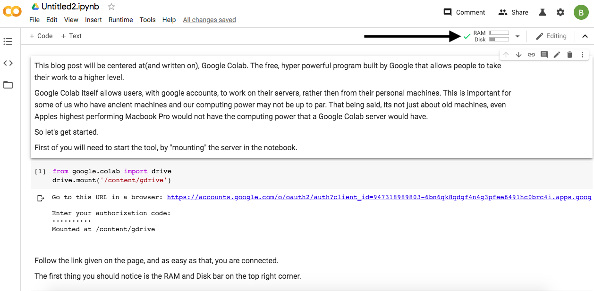

Title: Google Colab
Date: 2020-01-23
Slug: Third blog

This blog post will be centred about(and written on), Google Colab. The free, hyper-powerful program built by Google that allows people to take their work to a higher level.

Google Colab itself allows users, with Google accounts, to work on their servers, rather than from their machines. A helpful tool for some of us who have ancient devices and our computing power may not be up to par.  It's not just about old machines, even Apple's highest performing Macbook Pro would not have the computing power that a Google Colab server would have.

So let's get started.

First of you will need to start the tool by "mounting" the server in the notebook. Follow the link given on the page, and as easy as that, you are connected.


```python
from google.colab import drive
drive.mount('/content/gdrive')
```

The first thing you should notice is the RAM and Disk bar on the top right corner. These bars show you have connected and are now able to work.


```

Because this isn't a blog about specs, just for now, you should know that the more RAM and Disk Space, the smoother/faster your program will run.

Now, since you are signed on and ready to go, lets load in some data to begin working.

Google Colab runs strictly on Python; therefore, you can import in pandas just as you would with Jupyter Notebook or any other text editor of your choice


```python
import pandas as pd
```

This process will be slightly different than when you are calling the file compared to a regular Jupyter Notebook or text editor. I load my data into my google drive then call it from there.


```python
pd.read_csv('df = pd.read_csv('gdrive/My Drive/Colab Notebooks/data/(yourdatafile).csv')')
```

Now you are able to do all the analysis work you would do on any other platform, just much quicker

For those of you looking to run multiple machine learning models at one time, you can open multiple tabs, and connect to various servers from Google Colab and run them all at one time.

At the end of your work, you can download files from Google Colab as either .ipynb and open them on Jupyter, or download them as .py and run them on your local text editors of choice.

You can also download specific things you save by running the code:


```python
from google.colab import files
files.download(‘data.pkl’)
```

So harness the power of the free service offered by Google Colab today, and perform your analysis quicker today.
