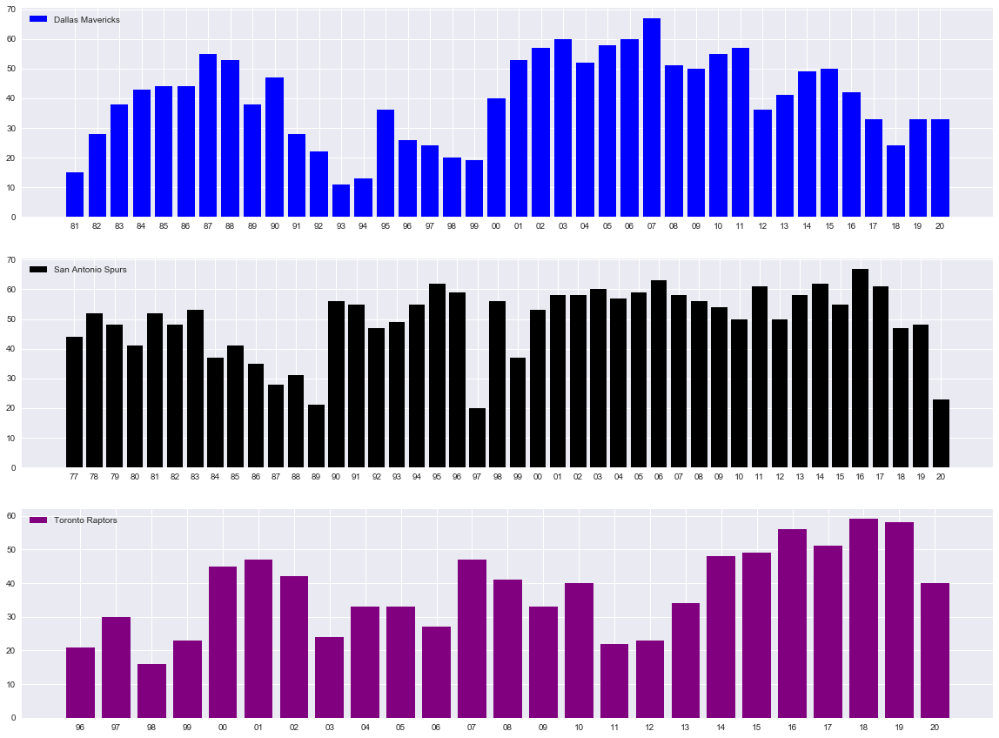

Title: Pymc3 and the NBA
Date: 2020-02-10
Slug: Fifth blog

Welcome back to the fifth blog in the BA blog series. The theme of today's blog is, by far, one of my favourite topics - sports. I will demonstrate the power that pymc3, a Bayesian statistical modelling package for python, has in the data science field.

To begin, we are going to import the usual suspects, along with my favourite way to play with NBA sports data, the nba_api package.


```python
import pandas as pd
import nba_api
import matplotlib.pyplot as plt
import numpy as np
import pymc3 as pm

from nba_api.stats.static import teams
from nba_api.stats.endpoints import leaguegamefinder
from nba_api.stats.endpoints import teamyearbyyearstats
```


```python
pd.set_option('display.max_columns',100)
```

This next step is calling the three teams we are going to be looking at closer today.

df will be the Dallas Mavericks
df1 will be the San Antonio Spurs
df2 will be the Utah Jazz


```python
team_dict = teams.get_teams()
```


```python
mavericks = [team for team in team_dict if team['full_name']=='Dallas Mavericks'][0]
spurs = [team for team in team_dict if team['full_name']=='San Antonio Spurs'][0]
raptors = [team for team in team_dict if team['full_name']=='Toronto Raptors'][0]
```


```python
mavericks_id = mavericks['id']
spurs_id = spurs['id']
raptors_id = raptors['id']
```


```python
df = teamyearbyyearstats.TeamYearByYearStats(mavericks_id).get_data_frames()[0]
df1 = teamyearbyyearstats.TeamYearByYearStats(spurs_id).get_data_frames()[0]
df2 = teamyearbyyearstats.TeamYearByYearStats(raptors_id).get_data_frames()[0]
```

The next two steps are a little cleaning to make the data more workable.


```python
df.columns = map(str.lower, df.columns)
df1.columns = map(str.lower, df.columns)
df2.columns = map(str.lower, df.columns)
```


```python
df['year'] = df['year'].str.split('-').str[1]
df1['year'] = df1['year'].str.split('-').str[1]
df2['year'] = df2['year'].str.split('-').str[1]
```

Now, let's plot the three teams using seaborn.

Notice that we are plotting each year the franchise has been around on the X-axis and the number of wins on the Y-axis.


```python
plt.style.use('seaborn')
fig, ax = plt.subplots(nrows=3, ncols=1, sharex=False, sharey=False,figsize=(20,15))

ax[0].bar(df['year'],df['wins'], color='blue', label = 'Dallas Mavericks')
ax[1].bar(df1['year'],df1['wins'], color='black', label = 'San Antonio Spurs')
ax[2].bar(df2['year'],df2['wins'], color='purple', label = 'Toronto Raptors')
ax[0].legend(loc='upper left')
ax[1].legend(loc='upper left')
ax[2].legend(loc='upper left')
plt.show()
```





Now the real magic begins - bring in pymc3!

The first pymc3 model we are going to run is on the Dallas Mavericks. We are going to run a model that has to lambdas, which you can see run using Normal distribution. These lambdas will measure each season wins total and try to notice a "change."

The change is the other import part of this model and its called the tau. The tau will return a number that represents when the model identifies a shift.

Running our first model:


```python
with pm.Model() as model:
    lambda_1 = pm.Normal('lambda_1', 10, 20)
    lambda_2 = pm.Normal('lambda_2', 10, 20)
    tau = pm.DiscreteUniform("tau", lower=5, upper=35)

    idx = np.arange(len(df)) # Index
    lambda_ = pm.math.switch(tau > idx, lambda_1, lambda_2)

    observation = pm.Normal("obs", lambda_, observed=df['wins'])
    trace = pm.sample(10000, tune=1000, chains=2)
```

    Multiprocess sampling (2 chains in 2 jobs)
    CompoundStep
    >NUTS: [lambda_2, lambda_1]
    >Metropolis: [tau]
    Sampling 2 chains, 0 divergences: 100%|██████████| 22000/22000 [00:15<00:00, 1400.18draws/s]
    The number of effective samples is smaller than 10% for some parameters.


```python
## Dirk
pm.summary(trace)
```


<div>
<style scoped>
    .dataframe tbody tr th:only-of-type {
        vertical-align: middle;
    }

    .dataframe tbody tr th {
        vertical-align: top;
    }

    .dataframe thead th {
        text-align: right;
    }
</style>
<table border="1" class="dataframe">
  <thead>
    <tr style="text-align: right;">
      <th></th>
      <th>mean</th>
      <th>sd</th>
      <th>hpd_3%</th>
      <th>hpd_97%</th>
      <th>mcse_mean</th>
      <th>mcse_sd</th>
      <th>ess_mean</th>
      <th>ess_sd</th>
      <th>ess_bulk</th>
      <th>ess_tail</th>
      <th>r_hat</th>
    </tr>
  </thead>
  <tbody>
    <tr>
      <td>lambda_1</td>
      <td>31.872</td>
      <td>0.282</td>
      <td>31.367</td>
      <td>32.425</td>
      <td>0.005</td>
      <td>0.004</td>
      <td>2730.0</td>
      <td>2716.0</td>
      <td>2894.0</td>
      <td>5336.0</td>
      <td>1.0</td>
    </tr>
    <tr>
      <td>lambda_2</td>
      <td>47.746</td>
      <td>0.270</td>
      <td>47.268</td>
      <td>48.282</td>
      <td>0.005</td>
      <td>0.004</td>
      <td>2776.0</td>
      <td>2768.0</td>
      <td>2956.0</td>
      <td>5347.0</td>
      <td>1.0</td>
    </tr>
    <tr>
      <td>tau</td>
      <td>19.215</td>
      <td>0.411</td>
      <td>19.000</td>
      <td>20.000</td>
      <td>0.012</td>
      <td>0.009</td>
      <td>1098.0</td>
      <td>1098.0</td>
      <td>1098.0</td>
      <td>1098.0</td>
      <td>1.0</td>
    </tr>
  </tbody>
</table>
</div>


Now for those of you that follow the NBA, you will have heard of someone called Dirk Nowitzki. He played his entire career for the Mavericks and was a perennial all start, which brought a championship to that team.

From the above summary, you can see that our model noticed a change on the 19th bar of the Dallas graph which correlates to the 98-99 season.

Drumroll, please, Dirk Nowitzki was drafted by the Dallas Mavericks in 98-99. Add the shocked monkey face from the previous blog. That is amazing that pymc3 noticed that something significant happened at this time.

Still a skeptic of pymc3, let's do another.


```python
with pm.Model() as model:
    lambda_1 = pm.Normal('lambda_1', 10, 20)
    lambda_2 = pm.Normal('lambda_2', 10, 20)
    tau = pm.DiscreteUniform("tau", lower=5, upper=50)

    idx = np.arange(len(df1)) # Index
    lambda_ = pm.math.switch(tau > idx, lambda_1, lambda_2)

    observation = pm.Normal("obs", lambda_, observed=df1['wins'])
    trace = pm.sample(10000, tune=1000, chains=2)
```

    Multiprocess sampling (2 chains in 2 jobs)
    CompoundStep
    >NUTS: [lambda_2, lambda_1]
    >Metropolis: [tau]
    Sampling 2 chains, 0 divergences: 100%|██████████| 22000/22000 [00:16<00:00, 1373.07draws/s]


```python
## Timmy D
pm.summary(trace)
```


<div>
<style scoped>
    .dataframe tbody tr th:only-of-type {
        vertical-align: middle;
    }

    .dataframe tbody tr th {
        vertical-align: top;
    }

    .dataframe thead th {
        text-align: right;
    }
</style>
<table border="1" class="dataframe">
  <thead>
    <tr style="text-align: right;">
      <th></th>
      <th>mean</th>
      <th>sd</th>
      <th>hpd_3%</th>
      <th>hpd_97%</th>
      <th>mcse_mean</th>
      <th>mcse_sd</th>
      <th>ess_mean</th>
      <th>ess_sd</th>
      <th>ess_bulk</th>
      <th>ess_tail</th>
      <th>r_hat</th>
    </tr>
  </thead>
  <tbody>
    <tr>
      <td>lambda_1</td>
      <td>44.651</td>
      <td>0.212</td>
      <td>44.255</td>
      <td>45.042</td>
      <td>0.002</td>
      <td>0.001</td>
      <td>18282.0</td>
      <td>18259.0</td>
      <td>18285.0</td>
      <td>12643.0</td>
      <td>1.0</td>
    </tr>
    <tr>
      <td>lambda_2</td>
      <td>55.134</td>
      <td>0.219</td>
      <td>54.725</td>
      <td>55.547</td>
      <td>0.002</td>
      <td>0.001</td>
      <td>18181.0</td>
      <td>18181.0</td>
      <td>18175.0</td>
      <td>13052.0</td>
      <td>1.0</td>
    </tr>
    <tr>
      <td>tau</td>
      <td>23.000</td>
      <td>0.000</td>
      <td>23.000</td>
      <td>23.000</td>
      <td>0.000</td>
      <td>0.000</td>
      <td>20000.0</td>
      <td>20000.0</td>
      <td>20000.0</td>
      <td>20000.0</td>
      <td>NaN</td>
    </tr>
  </tbody>
</table>
</div>


You notice from the summary that the tau is at 23 now, which correlates to the 98-99 season. That was the second year for arguably the best power forward to ever play in the NBA - Tim Duncan. He also went on to win multiple championships for his San Antonio Spurs.

Notice the only difference from the first model is the increase upper limit for tau because this team was around longer than the Dallas Mavericks.

Do you want to see one more? Of course, you do.


```python
with pm.Model() as model:
    lambda_1 = pm.Normal('lambda_1', 10, 20)
    lambda_2 = pm.Normal('lambda_2', 10, 20)
    tau = pm.DiscreteUniform("tau", lower=5, upper=15)

    idx = np.arange(len(df2)) # Index
    lambda_ = pm.math.switch(tau > idx, lambda_1, lambda_2)

    observation = pm.Normal("obs", lambda_, observed=df2['wins'])
    trace = pm.sample(10000, tune=1000, chains=2)
```

    Multiprocess sampling (2 chains in 2 jobs)
    CompoundStep
    >NUTS: [lambda_2, lambda_1]
    >Metropolis: [tau]
    Sampling 2 chains, 0 divergences: 100%|██████████| 22000/22000 [00:15<00:00, 1383.41draws/s]


```python
pm.summary(trace)
```


<div>
<style scoped>
    .dataframe tbody tr th:only-of-type {
        vertical-align: middle;
    }

    .dataframe tbody tr th {
        vertical-align: top;
    }

    .dataframe thead th {
        text-align: right;
    }
</style>
<table border="1" class="dataframe">
  <thead>
    <tr style="text-align: right;">
      <th></th>
      <th>mean</th>
      <th>sd</th>
      <th>hpd_3%</th>
      <th>hpd_97%</th>
      <th>mcse_mean</th>
      <th>mcse_sd</th>
      <th>ess_mean</th>
      <th>ess_sd</th>
      <th>ess_bulk</th>
      <th>ess_tail</th>
      <th>r_hat</th>
    </tr>
  </thead>
  <tbody>
    <tr>
      <td>lambda_1</td>
      <td>30.995</td>
      <td>0.305</td>
      <td>30.429</td>
      <td>31.569</td>
      <td>0.002</td>
      <td>0.002</td>
      <td>18299.0</td>
      <td>18294.0</td>
      <td>18313.0</td>
      <td>14028.0</td>
      <td>1.0</td>
    </tr>
    <tr>
      <td>lambda_2</td>
      <td>42.921</td>
      <td>0.268</td>
      <td>42.425</td>
      <td>43.425</td>
      <td>0.002</td>
      <td>0.001</td>
      <td>18507.0</td>
      <td>18507.0</td>
      <td>18513.0</td>
      <td>14695.0</td>
      <td>1.0</td>
    </tr>
    <tr>
      <td>tau</td>
      <td>11.000</td>
      <td>0.000</td>
      <td>11.000</td>
      <td>11.000</td>
      <td>0.000</td>
      <td>0.000</td>
      <td>20000.0</td>
      <td>20000.0</td>
      <td>20000.0</td>
      <td>20000.0</td>
      <td>NaN</td>
    </tr>
  </tbody>
</table>
</div>


This last one has a special place in my heart as a Canadian. The tau is 11, which correlates to the 2006-07 season for the Raptors. The first time the Raptors won a division title and maybe the season that built the culture, which helped them win the NBA championship in the 2018-19 season.

And with that, I hope you see the power of pymc3. It needs minimal inputs to make it work and is immensely powerful.

Go forth and use it for good!
