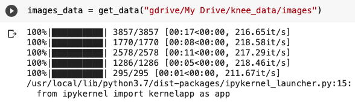
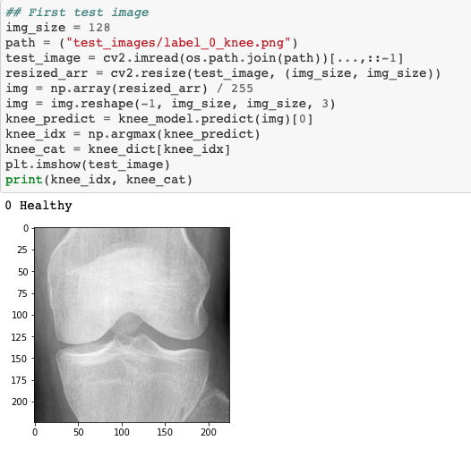

Title: How to Create an Image Classifier
Date: 2021-04-15
Slug: blog7


Today's post is, as the title says, how to create an image classifier. We will use a dataset from Kaggle(download here https://www.kaggle.com/shashwatwork/knee-osteoarthritis-dataset-with-severity). This data is x-rayed images of knees in different conditions. Some of the knees are very arithmetic, and some of these knees are in perfect condition - I encourage you to read the description in Kaggle if you'd like to learn more about what you are trying to predict.

This blog should be used as a blueprint for building an image classifier.

### **You should be able to take any type of image dataset and use this blueprint to create a working model.**

_This is all done on Google Colab_

This will be done in three simple steps: <br />
Step 1) Load the data <br />
Step 2) Train, test split the data <br />
Step 3) Model

__________________________________________________________________________________________________________

## Step 1) <br />

Once you have connected your google drive to your live google colab session, you can run this function to iterate through your folder with all your pictures inside.


```python
labels = ["0","1","2","3","4"]
img_size = 128
def get_data(data_dir):
    data = []
    for label in labels:
        path = os.path.join(data_dir, label)
        class_num = labels.index(label)
        for img in tqdm(os.listdir(path)):
            try:
                img_arr = cv2.imread(os.path.join(path, img))[...,::-1]
                resized_arr = cv2.resize(img_arr, (img_size, img_size))
                data.append([resized_arr, class_num])
            except Exception as e:
                print(e)
    return np.array(data)
```

The essential parts of this function are the labels section - you want to change this to your individual folders. For the knee data set, each class of image is labeled as 0, 1, 2, 3, 4, that's why it is labeled as such in the function.

Another essential part is the img_size part. You can set that to any size you would like; I felt like a larger image would make for a better model when dealing with x-ray imaging.

Then run the function, and save it, like such:


```python
images_data = get_data("gdrive/My Drive/knee_data/images")
```

The outlook will look like:


This shows how far you are into each folder and how long it will take to finish.

## Step 2)

Now is time to split the data.


```python
X = []
y = []
for feature, label in images_data:
  X.append(feature)
  y.append(label)

X = np.array(X) / 255

X.reshape(-1, img_size, img_size, 1)
y = np.array(y)

X_train, X_test, y_train, y_test = train_test_split(X, y, random_state=13)
```

Not much needs to be said about this - it is a straightforward step and necessary for successful machine learning models.


```python
datagen = ImageDataGenerator(
        featurewise_center=False,  # set input mean to 0 over the dataset
        samplewise_center=False,  # set each sample mean to 0
        featurewise_std_normalization=False,  # divide inputs by std of the dataset
        samplewise_std_normalization=False,  # divide each input by its std
        zca_whitening=False,  # apply ZCA whitening
        rotation_range = 30,  # randomly rotate images in the range (degrees, 0 to 180)
        zoom_range = 0.2, # Randomly zoom image
        width_shift_range=0.1,  # randomly shift images horizontally (fraction of total width)
        height_shift_range=0.1,  # randomly shift images vertically (fraction of total height)
        horizontal_flip = True,  # randomly flip images
        vertical_flip=False)  # randomly flip images


datagen.fit(X_train)
```

This part above is a bonus step. I encourage you to play around with it to find results that work best for you.

## Step 3)

Time to model - bring in TensorFlow


```python
model = Sequential()
model.add(Conv2D(32,3,padding="same", activation="relu", input_shape=(128,128,3)))
model.add(MaxPool2D())

model.add(Conv2D(32, 3, padding="same", activation="relu"))
model.add(MaxPool2D())

model.add(Conv2D(32, 3, padding="same", activation="elu"))
model.add(MaxPool2D())

model.add(Conv2D(64, 3, padding="same", activation="elu"))
model.add(MaxPool2D())
model.add(Dropout(0.4))

model.add(Flatten())
model.add(Dense(64,activation="relu"))
model.add(Dense(5, activation="softmax"))

model.summary()
```


```python
model.compile(optimizer = "adam" , loss = tf.keras.losses.SparseCategoricalCrossentropy(from_logits=True) , metrics = ['accuracy'])
```


```python
early_stop = EarlyStopping(monitor='val_loss', patience=10, verbose=0, mode='min')
mcp_save = ModelCheckpoint('gdrive/My Drive/knee_data/image/callback_model.h5', save_best_only=True, monitor='val_loss', mode='min')
```


```python
history = model.fit(X_train, y_train,
                   validation_data=(X_test, y_test),
                   epochs=40, batch_size=32,
                   verbose=2, callbacks=[early_stop, mcp_save])
```

Again, this code explains itself. With all TensorFlow models, the first step is to model, then compile, then fit.

I always add early stopping and save checkpoint for my models. Some of these models have long run times, so it is important to shut them down if it is statistically relevant.

That's it. You have created an image classification model using deep learning.

If you'd like to see how it works, you can use this code to see how it works on other images by calling the model.



Hope this has helped you create your own model!

If you'd like to see the full code, head to https://github.com/brandonanhorn/projects/blob/master/xray_knee/knee__arthritis.ipynb.

All the best to you.
